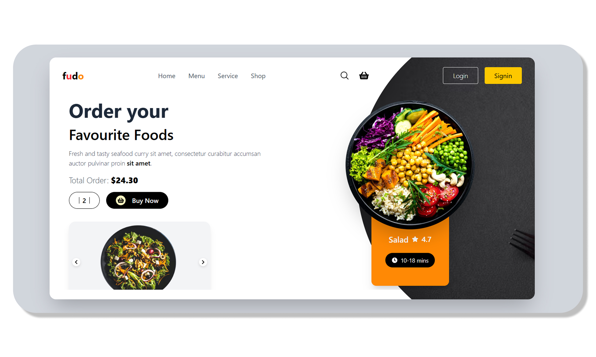

Here is a **professional, friendly, and medium-short README** for your **Food Landing React project**:

---

# 🥗 Food Landing Page

A beautiful, responsive **Food Landing Page UI** built using **React** and **Tailwind CSS**. This project showcases modern design with a clean navbar, hero section, interactive slider, and product highlights for a food delivery website.

## ✨ Features

* Responsive design for all devices
* Attractive navbar with login & signup buttons
* Hero section with call-to-action buttons
* Image slider with previous/next controls
* Product highlight card with ratings and delivery time

## 🚀 Technologies Used

* React JS
* Tailwind CSS
* React Icons

## 📂 Installation

1. **Clone this repository:**

```bash
git clone <repo-url>
```

2. **Navigate to the project folder:**

```bash
cd food-landing
```

3. **Install dependencies:**

```bash
npm install
```

4. **Start the development server:**

```bash
npm start
```

Open [http://localhost:3000](http://localhost:3000) to view it in your browser.

## 📸 Preview

## 📸 Preview




## 🙌 Author

Developed by **Vikas Bansode** – passionate about web development and UI design.

---

Let me know if you want a **YouTube video description** based on this README for your upcoming upload today.
